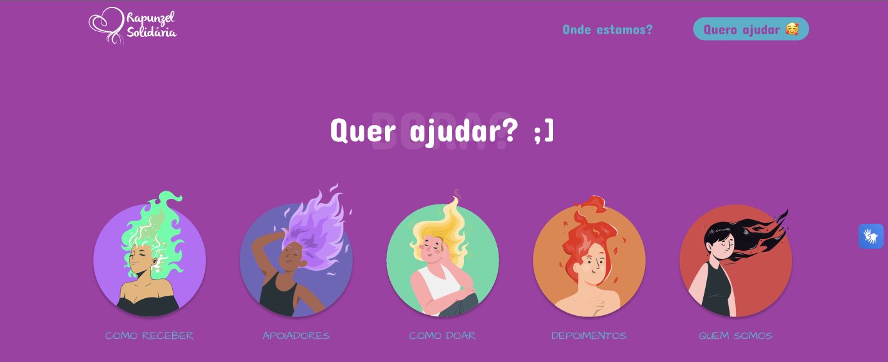

# Rapunzel Solidária

---

### <a href="https://rapunzel-solidaria.vercel.app/" target="_blank">Link para o site 🚀</a>

---

### O que é ?

Inspirado por um belo projeto chamado **Rapunzel Solidária**, tive a ideia de recriar o site já existente utilizando tecnologias modernas de desenvolvimento web.

O propósito deste site é **receber doações de cabelo** de todos os cantos do Brasil e do mundo, e confeccionar perucas para crianças, jovens e adultos que estão em tratamento contra o câncer e outras doenças que resultam na perda de cabelo, como a Alopecia.

Para obter mais informações sobre o projeto original, visite o [**site oficial**](https://www.rapunzelsolidaria.org.br/).



---

### Veja um pouco mais


---

### Links

- Rapunzel Solidária [NOVO] - [Link para o site 🚀](https://rapunzel-solidaria.vercel.app/)

- Figma - [Link para o figma 📱](https://www.google.com.br)

- Rapunzel Solidária [ORIGINAL] - [www.rapunzelsolidaria.org.br](https://www.rapunzelsolidaria.org.br/)

### Instalação do projeto && Como rodar

---

```sh
git clone https://github.com/duartecgustavo/rapunzel-solidaria.git 
npm i
npm run dev
```
ou
```sh
git clone https://github.com/duartecgustavo/rapunzel-solidaria.git 
yarn
yarn dev
```

---

### Tecnologias

**Frontend**
- ReactJS + Typescript
- Vite
- Atomic Design
- Styled Component
**Backend**
- NodeJS
**Banco de dados**
- SQL Server
**Deploy**
- Vercel
---

## Contato

- Linkedin: [linkedin.com/in/gustavo...](https://www.linkedin.com/in/gustavo-castanho-duarte-578127160)
- E-mail: [castanho.dev@outlook.com](castanho.dev@outlook.com)

---

## License
**MIT**

**Criado por castanho.dev**
